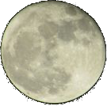

# Divination



[](https://github.com/shawninder/divination)

Get the weather for any city in the World!

- Current Weather
- 2 days of hour-by-hour previsions
- 7-day forecast
- Geolocation
- Localization (English and French, but please contribute more languages!)
- Dark Mode
- Auto-save location and preferences
- Keyboard-accessible
- Mobile-friendly
- Responsive UI

## Live Demo

[Hosted on Vercel](https://divination.vercel.app)

[](https://divination.vercel.app)

## About
A code project submitted to the Codementor [Code Projects](https://www.codementor.io/projects) initiative.

This is a [Next.js](https://nextjs.org/) application bootstrapped with [`create-next-app`](https://github.com/vercel/next.js/tree/canary/packages/create-next-app).

## You will need
This project uses the [OpenWeather](https://openweathermap.org/) API to get the meteorological conditions and [MapBox](https://www.mapbox.com/) for cartography. You'll need (free) accounts for both.

Once you have your accounts, you can find your API keys and tokens. Copy `.env.local.example` to a new file named `.env.local` and save your API keys and tokens there.

```
cp .env.local.example .env.local
```

## Other dependencies
The project also uses [Chart.js](https://www.npmjs.com/package/chart.js) for plotting, [date-fns](https://www.npmjs.com/package/date-fns) for time manipulation and a few other libraries (see all dependencies in [package.json](/package.json)). Install all dependencies with npm.

```sh
npm install
```

## Development setup
```sh
npm run dev
```

Open [http://localhost:3000](http://localhost:3000) with your browser to see the result.

## Tests
Using [Jest](https://jestjs.io/)
```sh
npm test
```

## Contributions welcome!
The objective of this project is to provide a realistic context for people to learn about programming for the web. With that in mind, if you'd like to contribute to this repository, please feel free to have a look at the [guidelines](/CONTRIBUTING.md), open [issues](https://github.com/shawninder/divination/issues) and submit your first [Pull Request](https://github.com/shawninder/divination/pulls)!

- Better coding practices
- Better performance
- Better visual design
- Additional features
- Translations for more languages

Anything goes!

It is intended for most pull requests to be accepted, but some may be refused for straying too far from the original goal, or for any other reason, really. If you're not sure, just open an issue with your idea before you start the work and any questions or details about the proposal can be discussed there.
